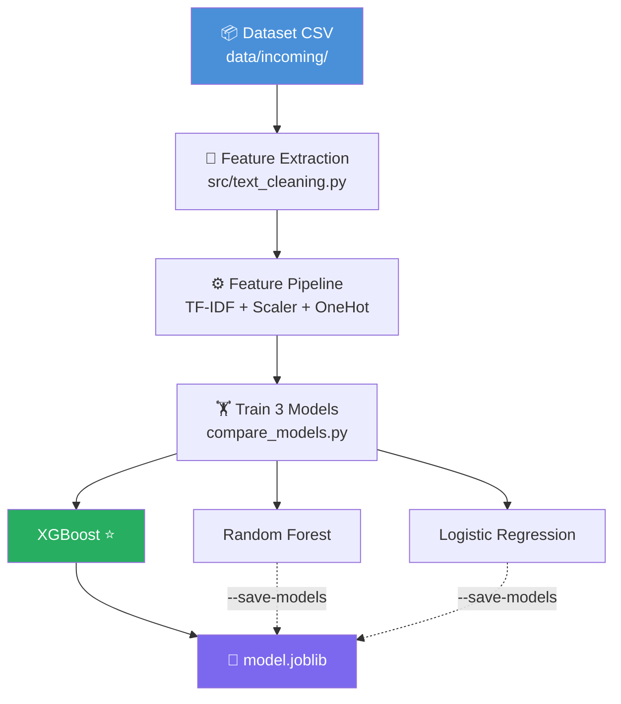
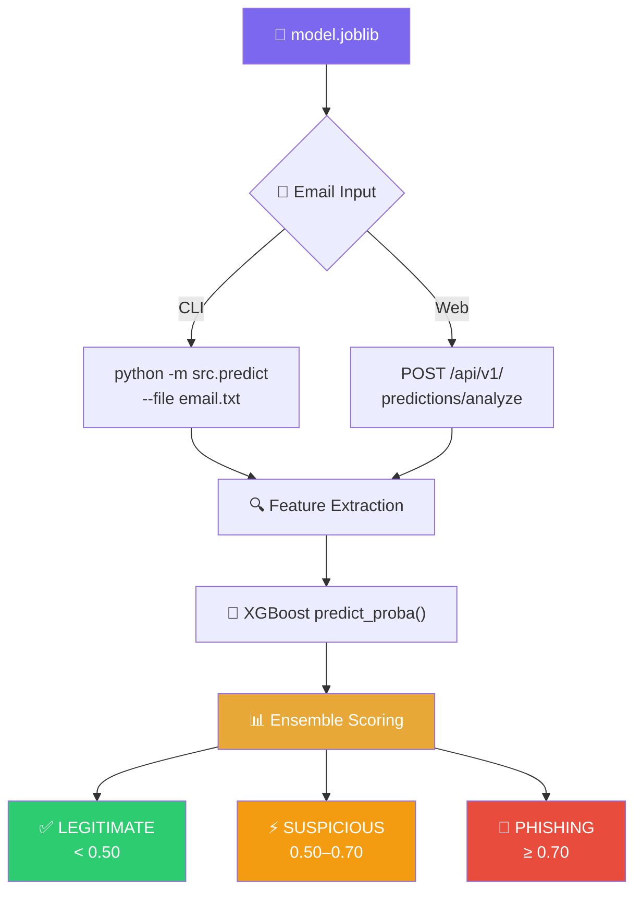
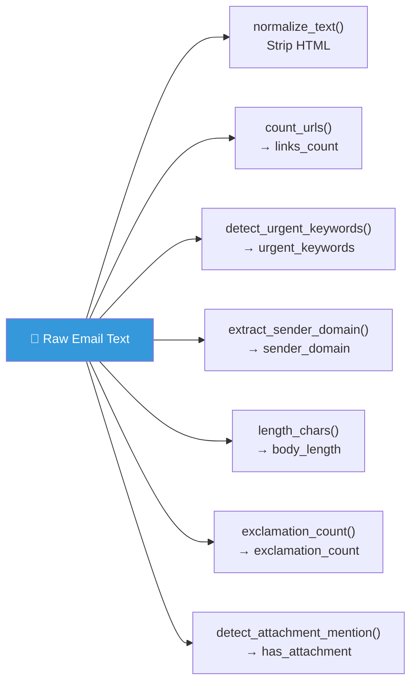
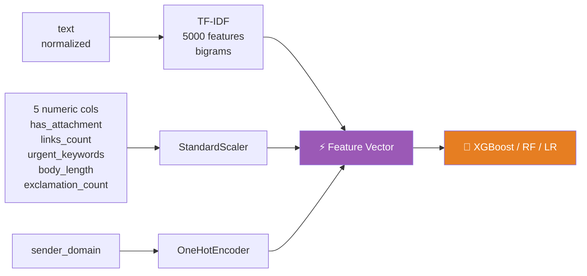
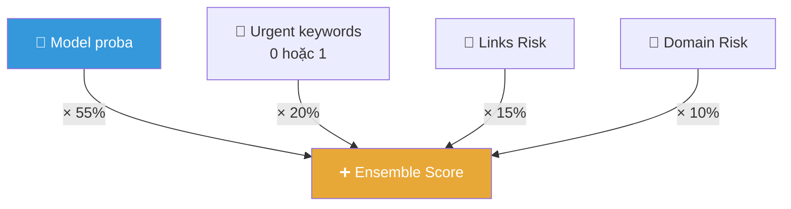
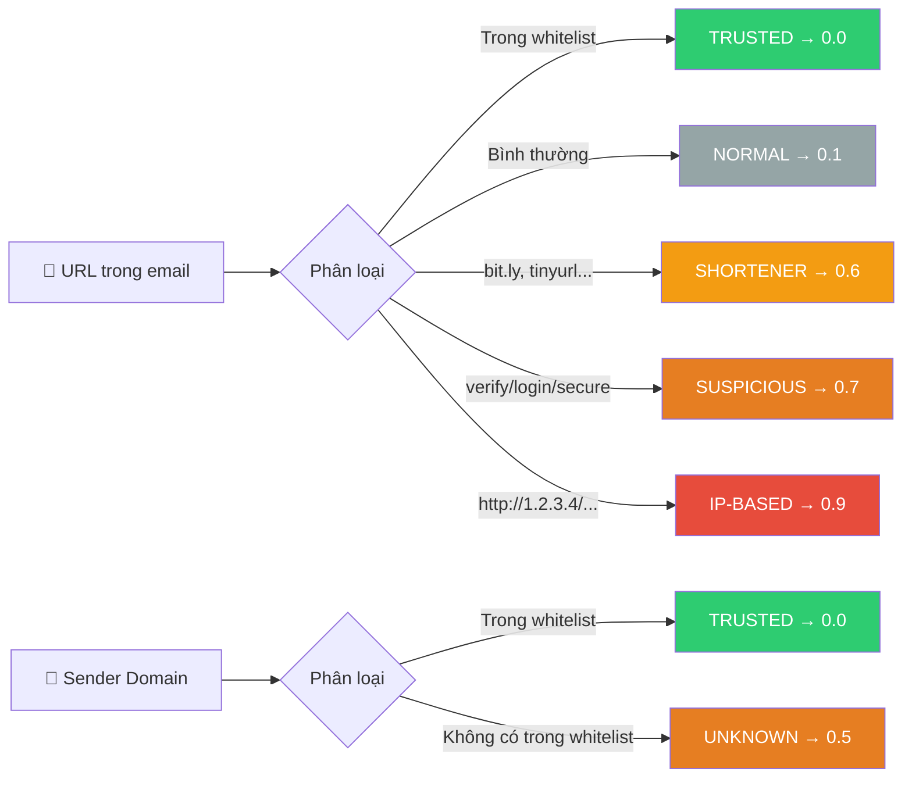
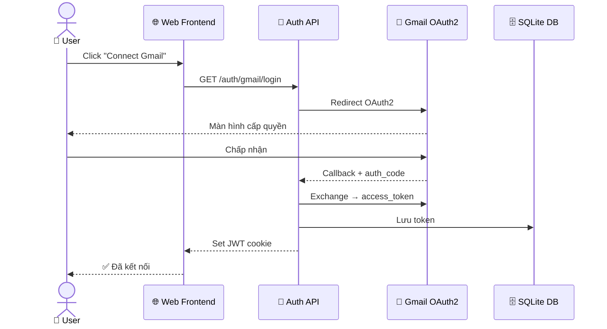
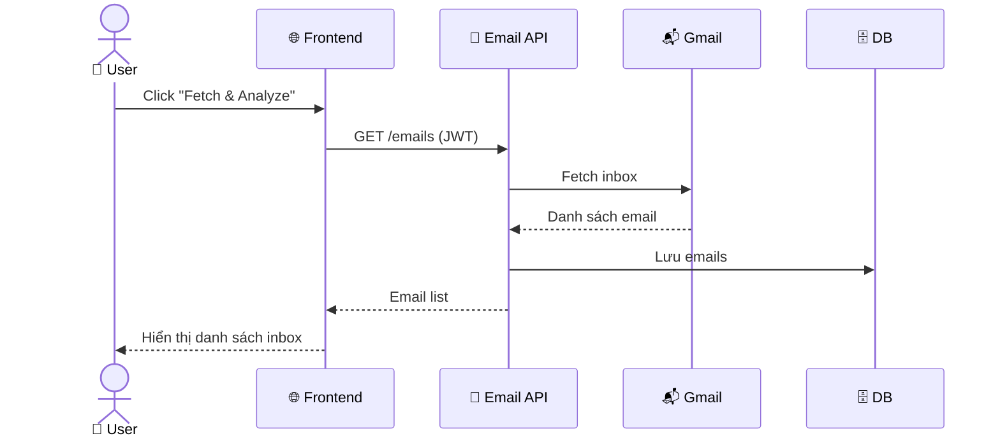
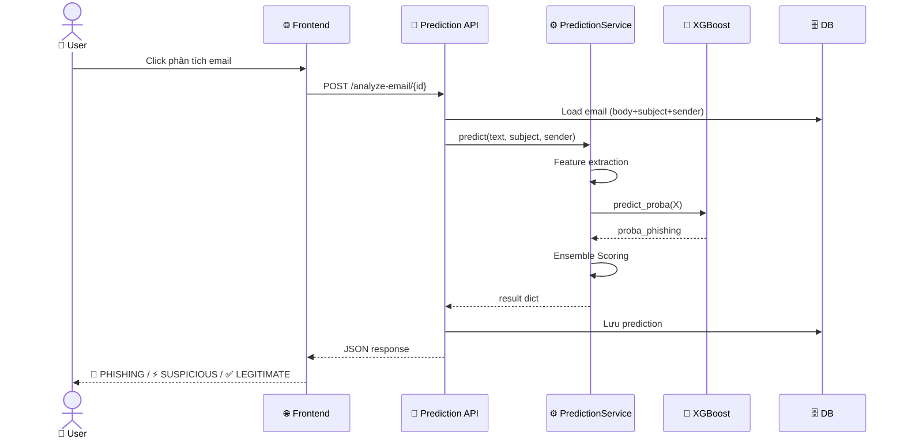
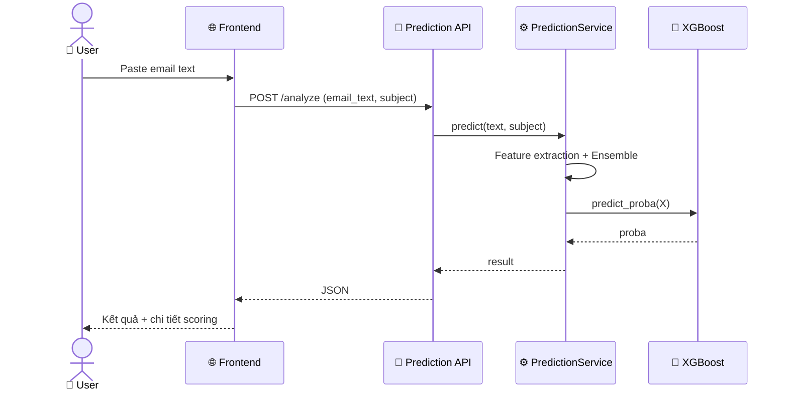

# 🔄 Pipeline Workflow — Phishing Email Detection

> **Dự án:** Final Project FPTU | **Cập nhật:** 13/03/2026

---

## 📊 Slide 1 — Tổng Quan: Giai Đoạn Training



---

## 📊 Slide 2 — Tổng Quan: Giai Đoạn Prediction



---

## 📊 Slide 3 — Feature Extraction: Text → 7 Features



---

## 📊 Slide 4 — Feature Pipeline: Preprocessing



---

## 📊 Slide 5 — Ensemble Scoring Formula



---

## 📊 Slide 6 — Links & Domain Risk Score



---

## 📊 Slide 7 — Web Flow: Đăng nhập Gmail



---

## 📊 Slide 8 — Web Flow: Fetch & Phân tích Inbox



---

## 📊 Slide 9 — Web Flow: Gọi Model Predict



---

## 📊 Slide 10 — Web Flow: Phân tích Email Thủ Công



---

## 🗂️ Tóm tắt lệnh

```bash
# Train & compare
python scripts/compare_models.py

# Train production model
python -m src.train

# Predict CLI
python -m src.predict --file samples/01_paypal_suspension.txt

# Start server
uvicorn app.main:app --reload --host 0.0.0.0 --port 5000
```
