# Sequence Diagrams — PhishGuard

Tập hợp các sơ đồ tuần tự (sequence diagram) mô tả luồng dữ liệu chính trong hệ thống. Tất cả diagram viết bằng [Mermaid](https://mermaid.js.org/) — GitHub và các IDE phổ biến (VS Code với plugin Mermaid Preview) đều render trực tiếp.

## Mục lục

1. [Đăng nhập (Mail API Connect)](#1-đăng-nhập-mail-api-connect)
2. [Kiểm tra phiên khi khởi động SPA](#2-kiểm-tra-phiên-khi-khởi-động-spa)
3. [Đăng xuất](#3-đăng-xuất)
4. [Fetch email thủ công](#4-fetch-email-thủ-công)
5. [Scheduler — Job fetch email định kỳ](#5-scheduler--job-fetch-email-định-kỳ)
6. [Scheduler — Job phân tích email định kỳ](#6-scheduler--job-phân-tích-email-định-kỳ)
7. [Scheduler — Job quét link VirusTotal](#7-scheduler--job-quét-link-virustotal)
8. [Phân tích email thủ công (paste text)](#8-phân-tích-email-thủ-công-paste-text)
9. [Dịch + phân tích bản dịch](#9-dịch--phân-tích-bản-dịch)
10. [VirusTotal URL scan chi tiết](#10-virustotal-url-scan-chi-tiết)
11. [Dashboard stats](#11-dashboard-stats)
12. [Bulk analyze (frontend)](#12-bulk-analyze-frontend)
13. [Xem chi tiết email](#13-xem-chi-tiết-email)
14. [Auto-refresh token khi hết hạn](#14-auto-refresh-token-khi-hết-hạn)
15. [Scheduler — Quét attachment qua VirusTotal](#15-scheduler--quét-attachment-qua-virustotal)
16. [Manual scan attachment cho 1 email](#16-manual-scan-attachment-cho-1-email)

Các bên tham gia trong toàn bộ tài liệu:

| Viết tắt | Ý nghĩa |
|----------|--------|
| **User** | Người dùng cuối trên trình duyệt |
| **SPA** | Frontend `frontend/js/app.js` (`App` + `ApiClient` + `AuthManager`) |
| **API** | FastAPI router (`app/api/v1/endpoints/*`) |
| **SVC** | Lớp service (`app/services/*`) |
| **DB** | SQLite (`data/app.db`) |
| **Mail** | Mail API server (port 8095) |
| **VT** | VirusTotal v3 (`https://www.virustotal.com/api/v3`) |
| **Gemini** | Google AI Studio (Gemini model) |
| **ML** | XGBoost Pipeline (`models/model.joblib`) |
| **Scheduler** | APScheduler (`scheduler_service.py`) |

---

## 1. Đăng nhập (Mail API Connect)

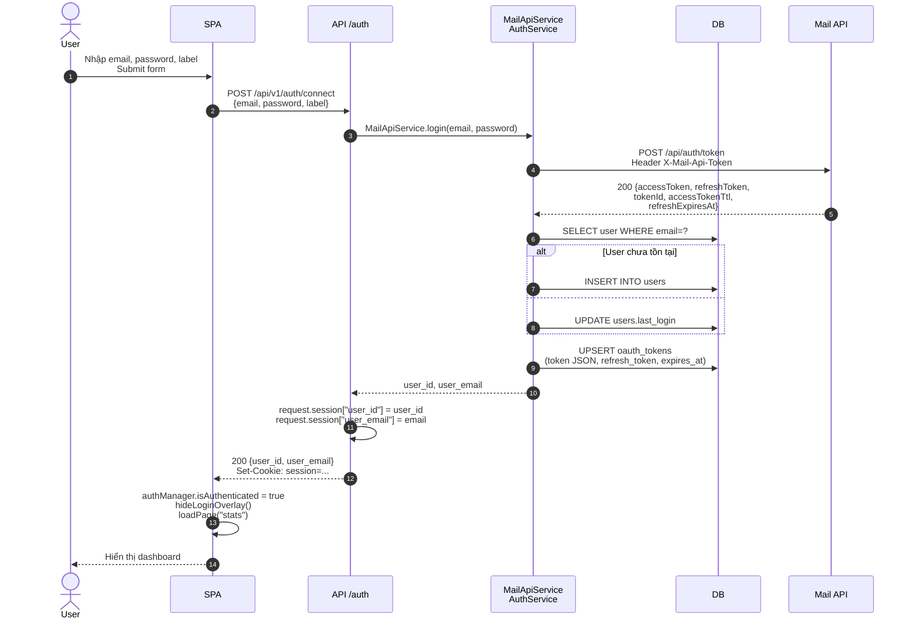
```mermaid
sequenceDiagram
    autonumber
    actor User
    participant SPA
    participant API as API /auth
    participant SVC as MailApiService<br/>AuthService
    participant DB
    participant Mail as Mail API

    User->>SPA: Nhập email, password, label<br/>Submit form
    SPA->>API: POST /api/v1/auth/connect<br/>{email, password, label}
    API->>SVC: MailApiService.login(email, password)
    SVC->>Mail: POST /api/auth/token<br/>Header X-Mail-Api-Token
    Mail-->>SVC: 200 {accessToken, refreshToken,<br/>tokenId, accessTokenTtl,<br/>refreshExpiresAt}
    SVC->>DB: SELECT user WHERE email=?
    alt User chưa tồn tại
        SVC->>DB: INSERT INTO users
    else
        SVC->>DB: UPDATE users.last_login
    end
    SVC->>DB: UPSERT oauth_tokens<br/>(token JSON, refresh_token, expires_at)
    SVC-->>API: user_id, user_email
    API->>API: request.session["user_id"] = user_id<br/>request.session["user_email"] = email
    API-->>SPA: 200 {user_id, user_email}<br/>Set-Cookie: session=...
    SPA->>SPA: authManager.isAuthenticated = true<br/>hideLoginOverlay()<br/>loadPage("stats")
    SPA-->>User: Hiển thị dashboard
```

**Ghi chú:**
- Session cookie được ký bằng `SECRET_KEY` (Starlette `SessionMiddleware`), `HttpOnly=true`, `SameSite=Lax`.
- Nếu Mail API trả lỗi (401/403), backend trả 401 với thông báo thân thiện; SPA giữ nguyên màn hình login và hiển thị flash message.

---

## 2. Kiểm tra phiên khi khởi động SPA

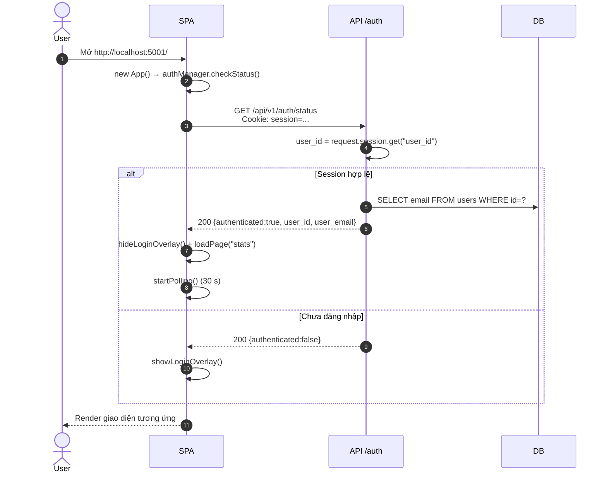
```mermaid
sequenceDiagram
    autonumber
    actor User
    participant SPA
    participant API as API /auth
    participant DB

    User->>SPA: Mở http://localhost:5001/
    SPA->>SPA: new App() → authManager.checkStatus()
    SPA->>API: GET /api/v1/auth/status<br/>Cookie: session=...
    API->>API: user_id = request.session.get("user_id")
    alt Session hợp lệ
        API->>DB: SELECT email FROM users WHERE id=?
        API-->>SPA: 200 {authenticated:true, user_id, user_email}
        SPA->>SPA: hideLoginOverlay() + loadPage("stats")
        SPA->>SPA: startPolling() (30 s)
    else Chưa đăng nhập
        API-->>SPA: 200 {authenticated:false}
        SPA->>SPA: showLoginOverlay()
    end
    SPA-->>User: Render giao diện tương ứng
```

---

## 3. Đăng xuất

```mermaid
sequenceDiagram
    autonumber
    actor User
    participant SPA
    participant API
    participant SVC as MailApiService<br/>AuthService
    participant Mail as Mail API
    participant DB

    User->>SPA: Click "Đăng xuất"
    SPA->>API: POST /api/v1/auth/disconnect
    API->>SVC: MailApiService.revoke(user_id)
    SVC->>DB: SELECT refresh_token FROM oauth_tokens
    SVC->>Mail: POST /api/auth/revoke<br/>{refreshToken}
    Mail-->>SVC: 200 OK
    API->>SVC: AuthService.delete_tokens(user_id)
    SVC->>DB: DELETE FROM oauth_tokens
    API->>API: request.session.clear()
    API-->>SPA: 200 {success:true}<br/>Set-Cookie: session=; Max-Age=0
    SPA->>SPA: stopPolling()<br/>showLoginOverlay()
    SPA-->>User: Quay lại màn đăng nhập
```

---

## 4. Fetch email thủ công

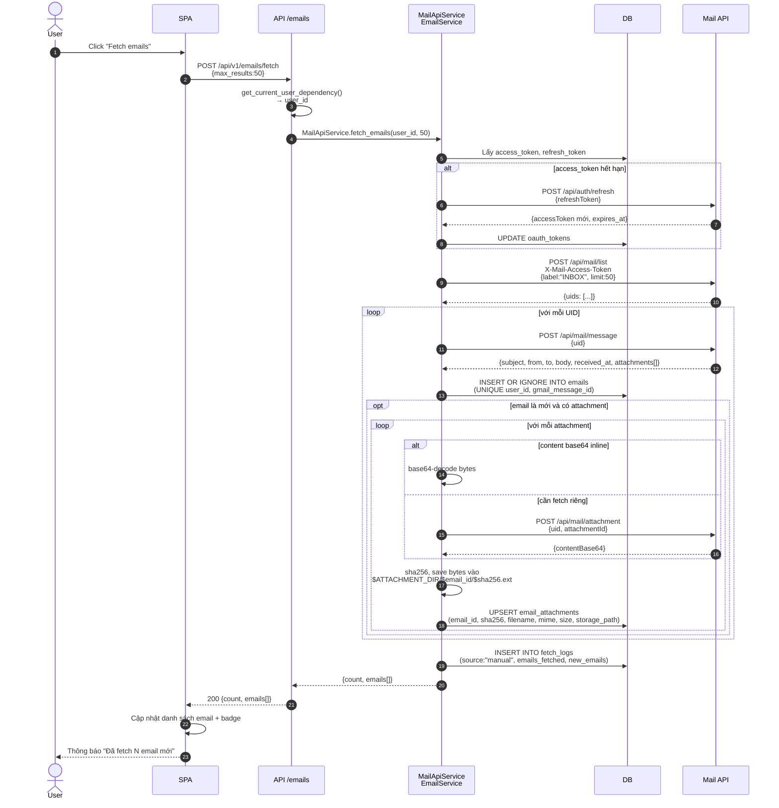
```mermaid
sequenceDiagram
    autonumber
    actor User
    participant SPA
    participant API as API /emails
    participant SVC as MailApiService<br/>EmailService
    participant DB
    participant Mail as Mail API

    User->>SPA: Click "Fetch emails"
    SPA->>API: POST /api/v1/emails/fetch<br/>{max_results:50}
    API->>API: get_current_user_dependency()<br/>→ user_id
    API->>SVC: MailApiService.fetch_emails(user_id, 50)
    SVC->>DB: Lấy access_token, refresh_token
    alt access_token hết hạn
        SVC->>Mail: POST /api/auth/refresh<br/>{refreshToken}
        Mail-->>SVC: {accessToken mới, expires_at}
        SVC->>DB: UPDATE oauth_tokens
    end
    SVC->>Mail: POST /api/mail/list<br/>X-Mail-Access-Token<br/>{label:"INBOX", limit:50}
    Mail-->>SVC: {uids: [...]}
    loop với mỗi UID
        SVC->>Mail: POST /api/mail/message<br/>{uid}
        Mail-->>SVC: {subject, from, to, body, received_at, attachments[]}
        SVC->>DB: INSERT OR IGNORE INTO emails<br/>(UNIQUE user_id, gmail_message_id)
        opt email là mới và có attachment
            loop với mỗi attachment
                alt content base64 inline
                    SVC->>SVC: base64-decode bytes
                else cần fetch riêng
                    SVC->>Mail: POST /api/mail/attachment<br/>{uid, attachmentId}
                    Mail-->>SVC: {contentBase64}
                end
                SVC->>SVC: sha256, save bytes vào<br/>$ATTACHMENT_DIR/$email_id/$sha256.ext
                SVC->>DB: UPSERT email_attachments<br/>(email_id, sha256, filename, mime, size, storage_path)
            end
        end
    end
    SVC->>DB: INSERT INTO fetch_logs<br/>(source:"manual", emails_fetched, new_emails)
    SVC-->>API: {count, emails[]}
    API-->>SPA: 200 {count, emails[]}
    SPA->>SPA: Cập nhật danh sách email + badge
    SPA-->>User: Thông báo "Đã fetch N email mới"
```

---

## 5. Scheduler — Job fetch email định kỳ

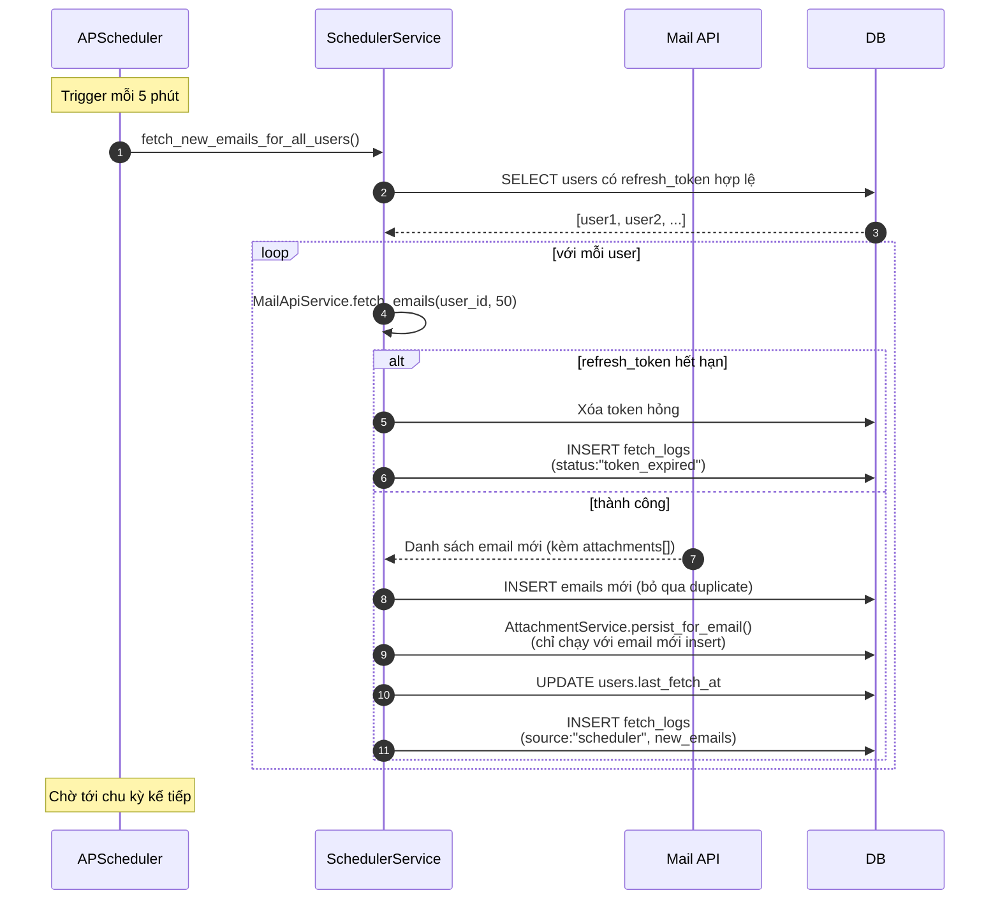
```mermaid
sequenceDiagram
    autonumber
    participant Scheduler as APScheduler
    participant Svc as SchedulerService
    participant Mail as Mail API
    participant DB

    Note over Scheduler: Trigger mỗi 5 phút
    Scheduler->>Svc: fetch_new_emails_for_all_users()
    Svc->>DB: SELECT users có refresh_token hợp lệ
    DB-->>Svc: [user1, user2, ...]
    loop với mỗi user
        Svc->>Svc: MailApiService.fetch_emails(user_id, 50)
        alt refresh_token hết hạn
            Svc->>DB: Xóa token hỏng
            Svc->>DB: INSERT fetch_logs<br/>(status:"token_expired")
        else thành công
            Mail-->>Svc: Danh sách email mới (kèm attachments[])
            Svc->>DB: INSERT emails mới (bỏ qua duplicate)
            Svc->>DB: AttachmentService.persist_for_email()<br/>(chỉ chạy với email mới insert)
            Svc->>DB: UPDATE users.last_fetch_at
            Svc->>DB: INSERT fetch_logs<br/>(source:"scheduler", new_emails)
        end
    end
    Note over Scheduler: Chờ tới chu kỳ kế tiếp
```

---

## 6. Scheduler — Job phân tích email định kỳ

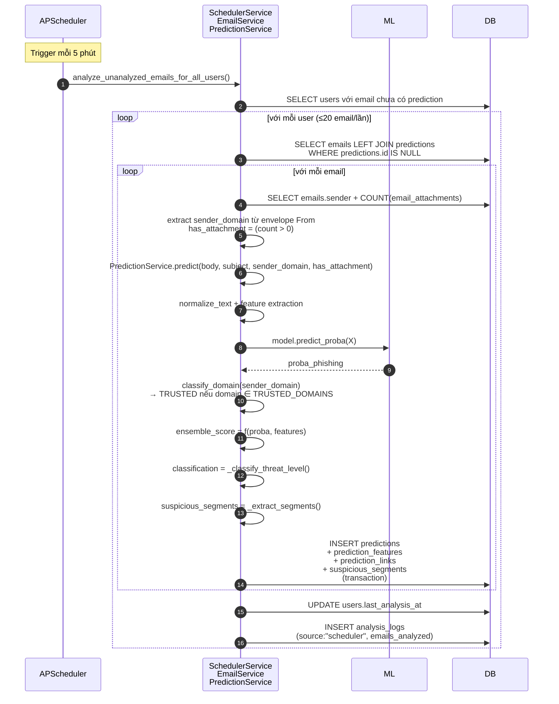
```mermaid
sequenceDiagram
    autonumber
    participant Scheduler as APScheduler
    participant Svc as SchedulerService<br/>EmailService<br/>PredictionService
    participant ML
    participant DB

    Note over Scheduler: Trigger mỗi 5 phút
    Scheduler->>Svc: analyze_unanalyzed_emails_for_all_users()
    Svc->>DB: SELECT users với email chưa có prediction
    loop với mỗi user (≤20 email/lần)
        Svc->>DB: SELECT emails LEFT JOIN predictions<br/>WHERE predictions.id IS NULL
        loop với mỗi email
            Svc->>DB: SELECT emails.sender + COUNT(email_attachments)
            Svc->>Svc: extract sender_domain từ envelope From<br/>has_attachment = (count > 0)
            Svc->>Svc: PredictionService.predict(body, subject, sender_domain, has_attachment)
            Svc->>Svc: normalize_text + feature extraction
            Svc->>ML: model.predict_proba(X)
            ML-->>Svc: proba_phishing
            Svc->>Svc: classify_domain(sender_domain)<br/>→ TRUSTED nếu domain ∈ TRUSTED_DOMAINS
            Svc->>Svc: ensemble_score = f(proba, features)
            Svc->>Svc: classification = _classify_threat_level()
            Svc->>Svc: suspicious_segments = _extract_segments()
            Svc->>DB: INSERT predictions<br/>+ prediction_features<br/>+ prediction_links<br/>+ suspicious_segments<br/>(transaction)
        end
        Svc->>DB: UPDATE users.last_analysis_at
        Svc->>DB: INSERT analysis_logs<br/>(source:"scheduler", emails_analyzed)
    end
```

---

## 7. Scheduler — Job quét link VirusTotal

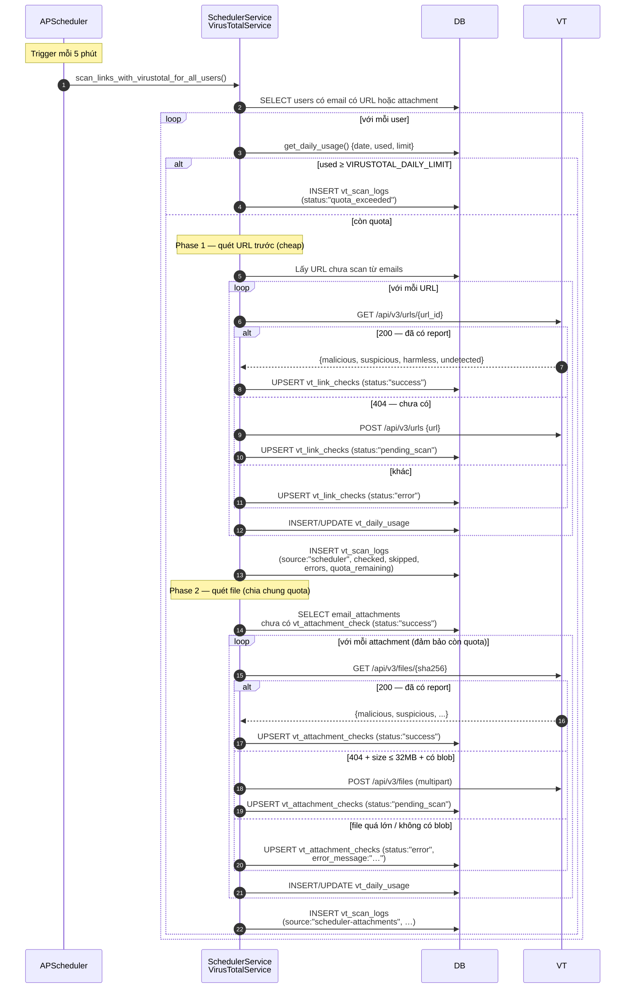
```mermaid
sequenceDiagram
    autonumber
    participant Scheduler as APScheduler
    participant Svc as SchedulerService<br/>VirusTotalService
    participant DB
    participant VT

    Note over Scheduler: Trigger mỗi 5 phút
    Scheduler->>Svc: scan_links_with_virustotal_for_all_users()
    Svc->>DB: SELECT users có email có URL hoặc attachment
    loop với mỗi user
        Svc->>DB: get_daily_usage() {date, used, limit}
        alt used ≥ VIRUSTOTAL_DAILY_LIMIT
            Svc->>DB: INSERT vt_scan_logs<br/>(status:"quota_exceeded")
        else còn quota
            Note over Svc: Phase 1 — quét URL trước (cheap)
            Svc->>DB: Lấy URL chưa scan từ emails
            loop với mỗi URL
                Svc->>VT: GET /api/v3/urls/{url_id}
                alt 200 — đã có report
                    VT-->>Svc: {malicious, suspicious, harmless, undetected}
                    Svc->>DB: UPSERT vt_link_checks (status:"success")
                else 404 — chưa có
                    Svc->>VT: POST /api/v3/urls {url}
                    Svc->>DB: UPSERT vt_link_checks (status:"pending_scan")
                else khác
                    Svc->>DB: UPSERT vt_link_checks (status:"error")
                end
                Svc->>DB: INSERT/UPDATE vt_daily_usage
            end
            Svc->>DB: INSERT vt_scan_logs<br/>(source:"scheduler", checked, skipped,<br/>errors, quota_remaining)

            Note over Svc: Phase 2 — quét file (chia chung quota)
            Svc->>DB: SELECT email_attachments<br/>chưa có vt_attachment_check (status:"success")
            loop với mỗi attachment (đảm bảo còn quota)
                Svc->>VT: GET /api/v3/files/{sha256}
                alt 200 — đã có report
                    VT-->>Svc: {malicious, suspicious, ...}
                    Svc->>DB: UPSERT vt_attachment_checks (status:"success")
                else 404 + size ≤ 32MB + có blob
                    Svc->>VT: POST /api/v3/files (multipart)
                    Svc->>DB: UPSERT vt_attachment_checks (status:"pending_scan")
                else file quá lớn / không có blob
                    Svc->>DB: UPSERT vt_attachment_checks (status:"error",<br/>error_message:"…")
                end
                Svc->>DB: INSERT/UPDATE vt_daily_usage
            end
            Svc->>DB: INSERT vt_scan_logs<br/>(source:"scheduler-attachments", …)
        end
    end
```

---

## 8. Phân tích email thủ công (paste text)

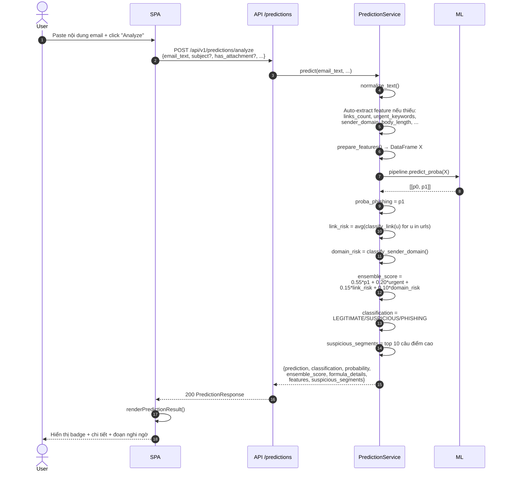
```mermaid
sequenceDiagram
    autonumber
    actor User
    participant SPA
    participant API as API /predictions
    participant Svc as PredictionService
    participant ML

    User->>SPA: Paste nội dung email + click "Analyze"
    SPA->>API: POST /api/v1/predictions/analyze<br/>{email_text, subject?, has_attachment?, ...}
    API->>Svc: predict(email_text, ...)
    Svc->>Svc: normalize_text()
    Svc->>Svc: Auto-extract feature nếu thiếu:<br/>links_count, urgent_keywords,<br/>sender_domain, body_length, ...
    Svc->>Svc: prepare_features() → DataFrame X
    Svc->>ML: pipeline.predict_proba(X)
    ML-->>Svc: [[p0, p1]]
    Svc->>Svc: proba_phishing = p1
    Svc->>Svc: link_risk = avg(classify_link(u) for u in urls)
    Svc->>Svc: domain_risk = classify_sender_domain()
    Svc->>Svc: ensemble_score =<br/>0.55*p1 + 0.20*urgent +<br/>0.15*link_risk + 0.10*domain_risk
    Svc->>Svc: classification =<br/>LEGITIMATE/SUSPICIOUS/PHISHING
    Svc->>Svc: suspicious_segments = top 10 câu điểm cao
    Svc-->>API: {prediction, classification, probability,<br/>ensemble_score, formula_details,<br/>features, suspicious_segments}
    API-->>SPA: 200 PredictionResponse
    SPA->>SPA: renderPredictionResult()
    SPA-->>User: Hiển thị badge + chi tiết + đoạn nghi ngờ
```

---

## 9. Dịch + phân tích bản dịch

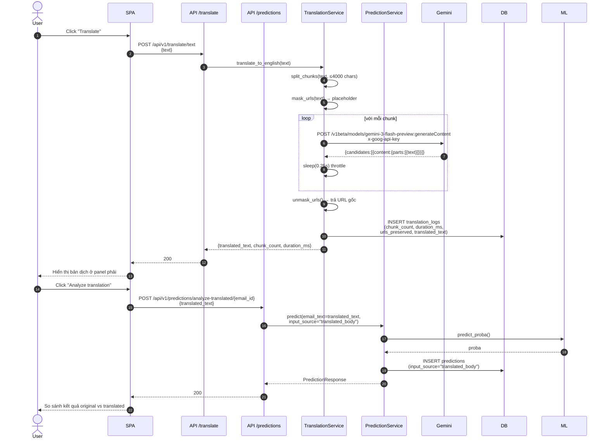
```mermaid
sequenceDiagram
    autonumber
    actor User
    participant SPA
    participant API_T as API /translate
    participant API_P as API /predictions
    participant Svc_T as TranslationService
    participant Svc_P as PredictionService
    participant Gemini
    participant DB
    participant ML

    User->>SPA: Click "Translate"
    SPA->>API_T: POST /api/v1/translate/text<br/>{text}
    API_T->>Svc_T: translate_to_english(text)
    Svc_T->>Svc_T: split_chunks(text, ≤4000 chars)
    Svc_T->>Svc_T: mask_urls(text) → placeholder
    loop với mỗi chunk
        Svc_T->>Gemini: POST /v1beta/models/gemini-3-flash-preview:generateContent<br/>x-goog-api-key
        Gemini-->>Svc_T: {candidates:[{content:{parts:[{text}]}}]}
        Svc_T->>Svc_T: sleep(0.25s) throttle
    end
    Svc_T->>Svc_T: unmask_urls() → trả URL gốc
    Svc_T->>DB: INSERT translation_logs<br/>(chunk_count, duration_ms,<br/>urls_preserved, translated_text)
    Svc_T-->>API_T: {translated_text, chunk_count, duration_ms}
    API_T-->>SPA: 200
    SPA-->>User: Hiển thị bản dịch ở panel phải

    User->>SPA: Click "Analyze translation"
    SPA->>API_P: POST /api/v1/predictions/analyze-translated/{email_id}<br/>{translated_text}
    API_P->>Svc_P: predict(email_text=translated_text,<br/>input_source="translated_body")
    Svc_P->>ML: predict_proba()
    ML-->>Svc_P: proba
    Svc_P->>DB: INSERT predictions<br/>(input_source="translated_body")
    Svc_P-->>API_P: PredictionResponse
    API_P-->>SPA: 200
    SPA-->>User: So sánh kết quả original vs translated
```

**Ghi chú:** URL masking là cơ chế thay thế `https://foo.bar` bằng `__URL_0__` trước khi gửi Gemini, sau đó thay lại. Điều này tránh Gemini "dịch sai" URL thành chuỗi tiếng Việt vô nghĩa.

---

## 10. VirusTotal URL scan chi tiết

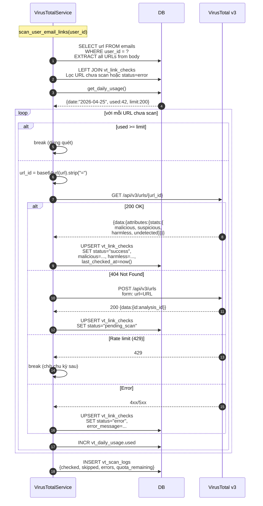
```mermaid
sequenceDiagram
    autonumber
    participant Svc as VirusTotalService
    participant DB
    participant VT as VirusTotal v3

    Note over Svc: scan_user_email_links(user_id)
    Svc->>DB: SELECT url FROM emails<br/>WHERE user_id = ?<br/>EXTRACT all URLs from body
    Svc->>DB: LEFT JOIN vt_link_checks<br/>Lọc URL chưa scan hoặc status=error
    Svc->>DB: get_daily_usage()
    DB-->>Svc: {date:"2026-04-25", used:42, limit:200}

    loop với mỗi URL chưa scan
        alt used >= limit
            Svc->>Svc: break (dừng quét)
        else
            Svc->>Svc: url_id = base64url(url).strip("=")
            Svc->>VT: GET /api/v3/urls/{url_id}
            alt 200 OK
                VT-->>Svc: {data:{attributes:{stats:{<br/>malicious, suspicious,<br/>harmless, undetected}}}}
                Svc->>DB: UPSERT vt_link_checks<br/>SET status="success",<br/>malicious=..., harmless=...,<br/>last_checked_at=now()
            else 404 Not Found
                Svc->>VT: POST /api/v3/urls<br/>form: url=URL
                VT-->>Svc: 200 {data:{id:analysis_id}}
                Svc->>DB: UPSERT vt_link_checks<br/>SET status="pending_scan"
            else Rate limit (429)
                VT-->>Svc: 429
                Svc->>Svc: break (chờ chu kỳ sau)
            else Error
                VT-->>Svc: 4xx/5xx
                Svc->>DB: UPSERT vt_link_checks<br/>SET status="error",<br/>error_message=...
            end
            Svc->>DB: INCR vt_daily_usage.used
        end
    end
    Svc->>DB: INSERT vt_scan_logs<br/>{checked, skipped, errors, quota_remaining}
```

---

## 11. Dashboard stats

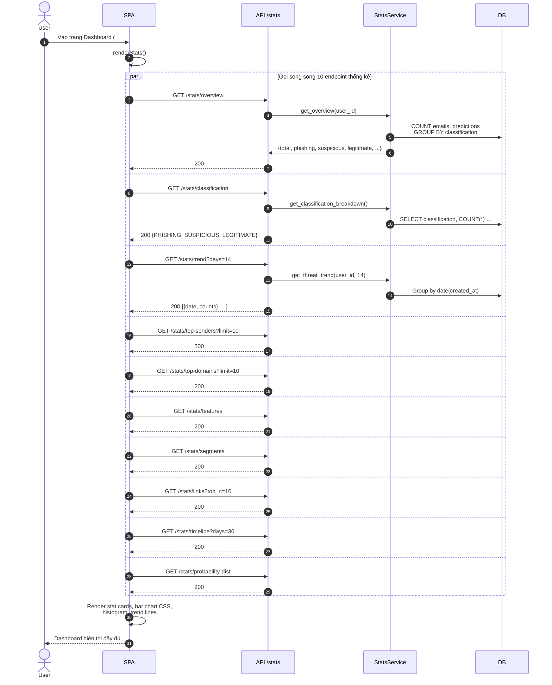
```mermaid
sequenceDiagram
    autonumber
    actor User
    participant SPA
    participant API as API /stats
    participant Svc as StatsService
    participant DB

    User->>SPA: Vào trang Dashboard (#stats)
    SPA->>SPA: renderStats()
    par Gọi song song 10 endpoint thống kê
        SPA->>API: GET /stats/overview
        API->>Svc: get_overview(user_id)
        Svc->>DB: COUNT emails, predictions<br/>GROUP BY classification
        Svc-->>API: {total, phishing, suspicious, legitimate, ...}
        API-->>SPA: 200
    and
        SPA->>API: GET /stats/classification
        API->>Svc: get_classification_breakdown()
        Svc->>DB: SELECT classification, COUNT(*) ...
        API-->>SPA: 200 {PHISHING, SUSPICIOUS, LEGITIMATE}
    and
        SPA->>API: GET /stats/trend?days=14
        API->>Svc: get_threat_trend(user_id, 14)
        Svc->>DB: Group by date(created_at)
        API-->>SPA: 200 [{date, counts}, ...]
    and
        SPA->>API: GET /stats/top-senders?limit=10
        API-->>SPA: 200
    and
        SPA->>API: GET /stats/top-domains?limit=10
        API-->>SPA: 200
    and
        SPA->>API: GET /stats/features
        API-->>SPA: 200
    and
        SPA->>API: GET /stats/segments
        API-->>SPA: 200
    and
        SPA->>API: GET /stats/links?top_n=10
        API-->>SPA: 200
    and
        SPA->>API: GET /stats/timeline?days=30
        API-->>SPA: 200
    and
        SPA->>API: GET /stats/probability-dist
        API-->>SPA: 200
    end
    SPA->>SPA: Render stat cards, bar chart CSS,<br/>histogram, trend lines
    SPA-->>User: Dashboard hiển thị đầy đủ
```

---

## 12. Bulk analyze (frontend)

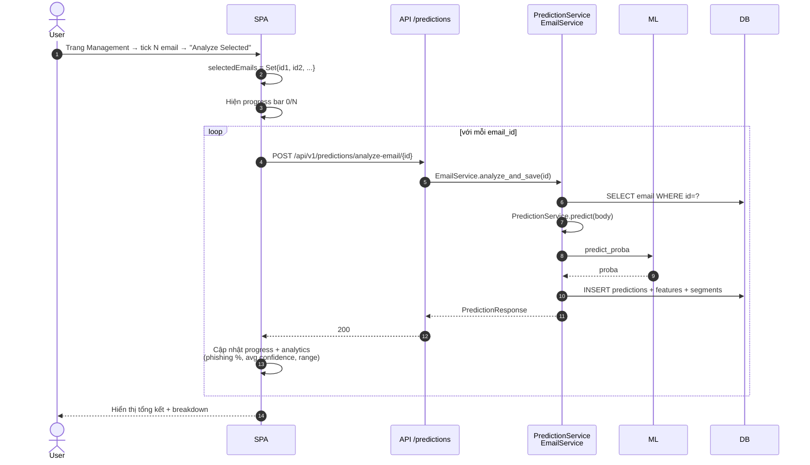
```mermaid
sequenceDiagram
    autonumber
    actor User
    participant SPA
    participant API as API /predictions
    participant Svc as PredictionService<br/>EmailService
    participant ML
    participant DB

    User->>SPA: Trang Management → tick N email → "Analyze Selected"
    SPA->>SPA: selectedEmails = Set{id1, id2, ...}
    SPA->>SPA: Hiện progress bar 0/N
    loop với mỗi email_id
        SPA->>API: POST /api/v1/predictions/analyze-email/{id}
        API->>Svc: EmailService.analyze_and_save(id)
        Svc->>DB: SELECT email WHERE id=?
        Svc->>Svc: PredictionService.predict(body)
        Svc->>ML: predict_proba
        ML-->>Svc: proba
        Svc->>DB: INSERT predictions + features + segments
        Svc-->>API: PredictionResponse
        API-->>SPA: 200
        SPA->>SPA: Cập nhật progress + analytics<br/>(phishing %, avg confidence, range)
    end
    SPA-->>User: Hiển thị tổng kết + breakdown
```

**Ghi chú:** Frontend gọi tuần tự thay vì song song để tránh quá tải backend và hiển thị tiến độ chi tiết cho user.

---

## 13. Xem chi tiết email

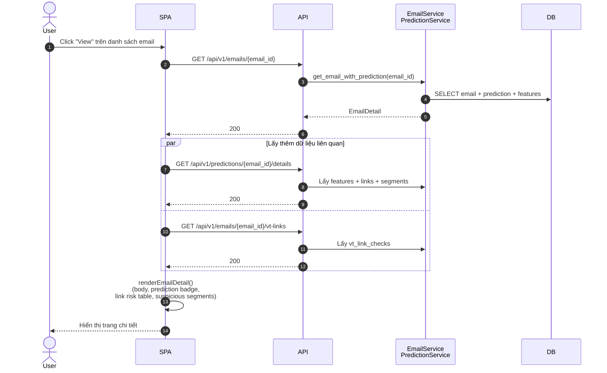
```mermaid
sequenceDiagram
    autonumber
    actor User
    participant SPA
    participant API
    participant Svc as EmailService<br/>PredictionService
    participant DB

    User->>SPA: Click "View" trên danh sách email
    SPA->>API: GET /api/v1/emails/{email_id}
    API->>Svc: get_email_with_prediction(email_id)
    Svc->>DB: SELECT email + prediction + features
    Svc-->>API: EmailDetail
    API-->>SPA: 200
    par Lấy thêm dữ liệu liên quan
        SPA->>API: GET /api/v1/predictions/{email_id}/details
        API->>Svc: Lấy features + links + segments
        API-->>SPA: 200
    and
        SPA->>API: GET /api/v1/emails/{email_id}/vt-links
        API->>Svc: Lấy vt_link_checks
        API-->>SPA: 200
    end
    SPA->>SPA: renderEmailDetail()<br/>(body, prediction badge,<br/>link risk table, suspicious segments)
    SPA-->>User: Hiển thị trang chi tiết
```

---

## 14. Auto-refresh token khi hết hạn

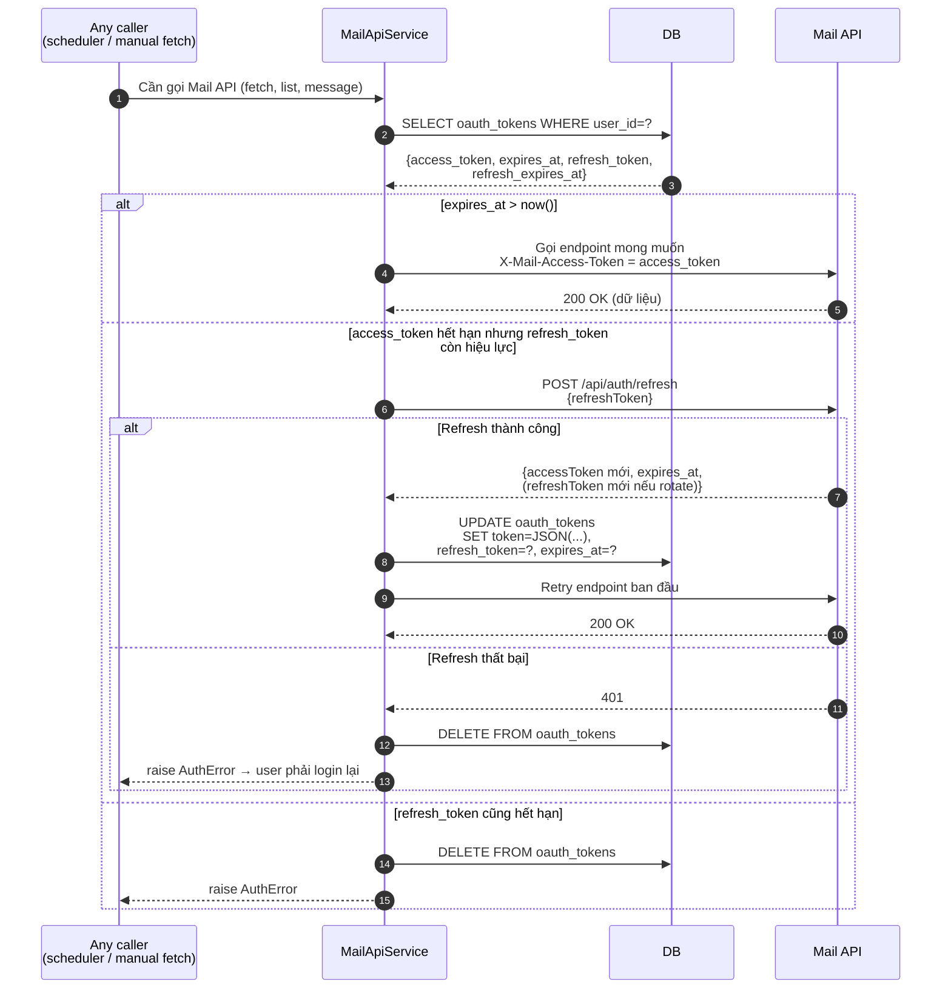
```mermaid
sequenceDiagram
    autonumber
    participant Any as Any caller<br/>(scheduler / manual fetch)
    participant SVC as MailApiService
    participant DB
    participant Mail as Mail API

    Any->>SVC: Cần gọi Mail API (fetch, list, message)
    SVC->>DB: SELECT oauth_tokens WHERE user_id=?
    DB-->>SVC: {access_token, expires_at, refresh_token,<br/>refresh_expires_at}
    alt expires_at > now()
        SVC->>Mail: Gọi endpoint mong muốn<br/>X-Mail-Access-Token = access_token
        Mail-->>SVC: 200 OK (dữ liệu)
    else access_token hết hạn nhưng refresh_token còn hiệu lực
        SVC->>Mail: POST /api/auth/refresh<br/>{refreshToken}
        alt Refresh thành công
            Mail-->>SVC: {accessToken mới, expires_at,<br/>(refreshToken mới nếu rotate)}
            SVC->>DB: UPDATE oauth_tokens<br/>SET token=JSON(...),<br/>refresh_token=?, expires_at=?
            SVC->>Mail: Retry endpoint ban đầu
            Mail-->>SVC: 200 OK
        else Refresh thất bại
            Mail-->>SVC: 401
            SVC->>DB: DELETE FROM oauth_tokens
            SVC-->>Any: raise AuthError → user phải login lại
        end
    else refresh_token cũng hết hạn
        SVC->>DB: DELETE FROM oauth_tokens
        SVC-->>Any: raise AuthError
    end
```

---

## 15. Scheduler — Quét attachment qua VirusTotal

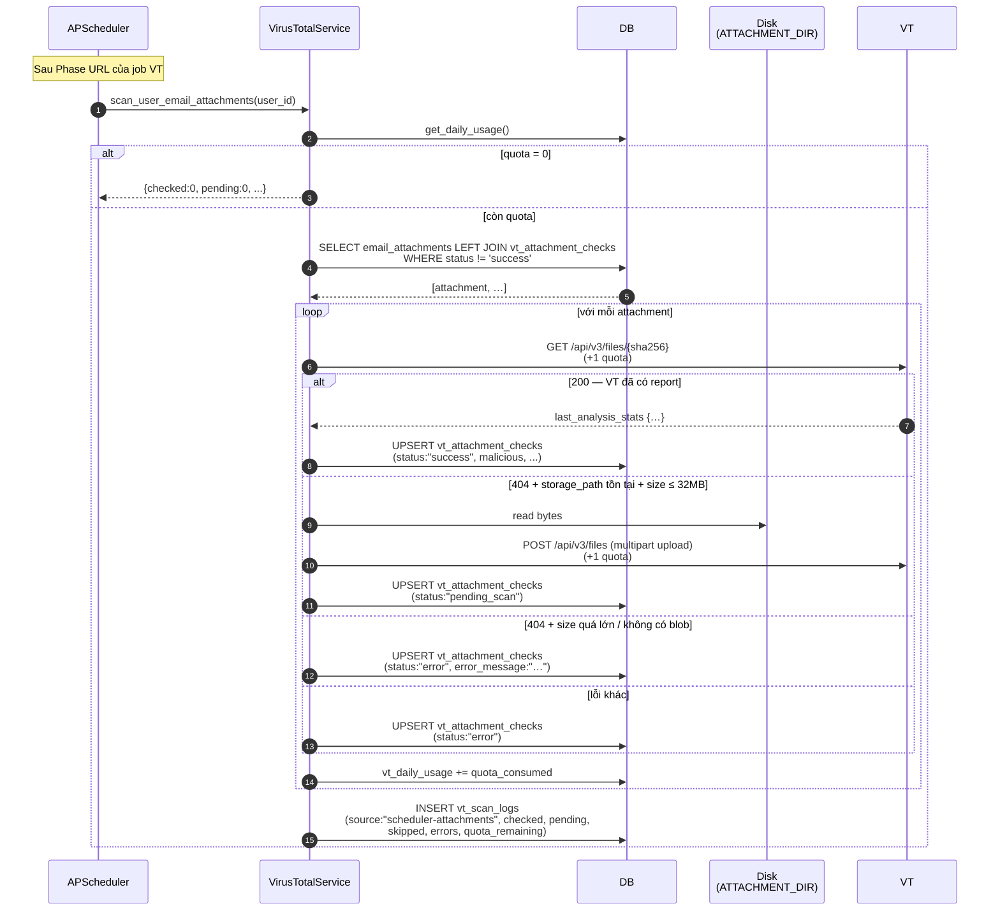
```mermaid
sequenceDiagram
    autonumber
    participant Scheduler as APScheduler
    participant Svc as VirusTotalService
    participant DB
    participant FS as Disk<br/>(ATTACHMENT_DIR)
    participant VT

    Note over Scheduler: Sau Phase URL của job VT
    Scheduler->>Svc: scan_user_email_attachments(user_id)
    Svc->>DB: get_daily_usage()
    alt quota = 0
        Svc-->>Scheduler: {checked:0, pending:0, ...}
    else còn quota
        Svc->>DB: SELECT email_attachments LEFT JOIN vt_attachment_checks<br/>WHERE status != 'success'
        DB-->>Svc: [attachment, …]
        loop với mỗi attachment
            Svc->>VT: GET /api/v3/files/{sha256}<br/>(+1 quota)
            alt 200 — VT đã có report
                VT-->>Svc: last_analysis_stats {…}
                Svc->>DB: UPSERT vt_attachment_checks<br/>(status:"success", malicious, ...)
            else 404 + storage_path tồn tại + size ≤ 32MB
                Svc->>FS: read bytes
                Svc->>VT: POST /api/v3/files (multipart upload)<br/>(+1 quota)
                Svc->>DB: UPSERT vt_attachment_checks<br/>(status:"pending_scan")
            else 404 + size quá lớn / không có blob
                Svc->>DB: UPSERT vt_attachment_checks<br/>(status:"error", error_message:"…")
            else lỗi khác
                Svc->>DB: UPSERT vt_attachment_checks<br/>(status:"error")
            end
            Svc->>DB: vt_daily_usage += quota_consumed
        end
        Svc->>DB: INSERT vt_scan_logs<br/>(source:"scheduler-attachments", checked, pending,<br/>skipped, errors, quota_remaining)
    end
```

---

## 16. Manual scan attachment cho 1 email

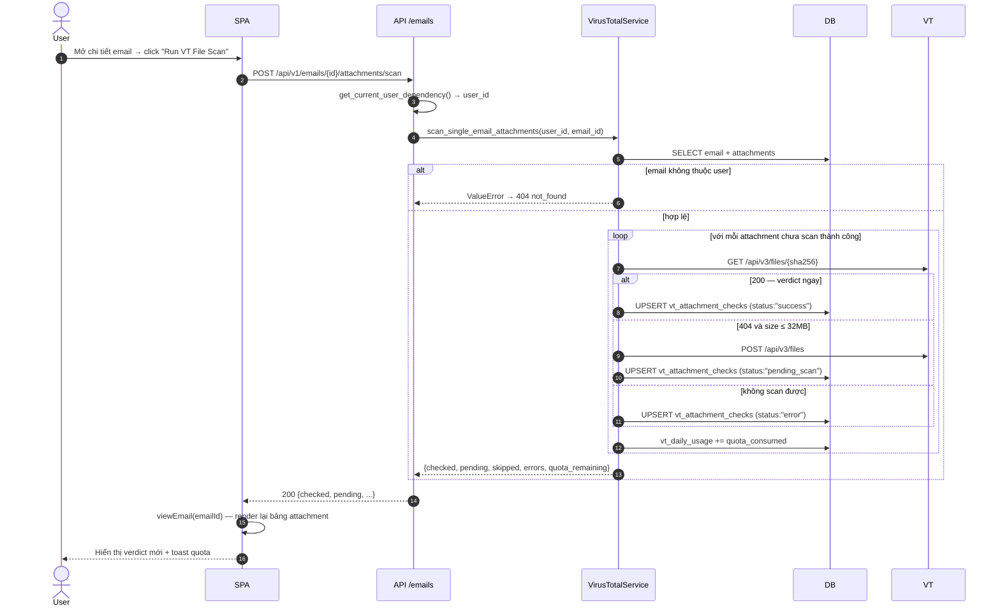
```mermaid
sequenceDiagram
    autonumber
    actor User
    participant SPA
    participant API as API /emails
    participant Svc as VirusTotalService
    participant DB
    participant VT

    User->>SPA: Mở chi tiết email → click "Run VT File Scan"
    SPA->>API: POST /api/v1/emails/{id}/attachments/scan
    API->>API: get_current_user_dependency() → user_id
    API->>Svc: scan_single_email_attachments(user_id, email_id)
    Svc->>DB: SELECT email + attachments
    alt email không thuộc user
        Svc-->>API: ValueError → 404 not_found
    else hợp lệ
        loop với mỗi attachment chưa scan thành công
            Svc->>VT: GET /api/v3/files/{sha256}
            alt 200 — verdict ngay
                Svc->>DB: UPSERT vt_attachment_checks (status:"success")
            else 404 và size ≤ 32MB
                Svc->>VT: POST /api/v3/files
                Svc->>DB: UPSERT vt_attachment_checks (status:"pending_scan")
            else không scan được
                Svc->>DB: UPSERT vt_attachment_checks (status:"error")
            end
            Svc->>DB: vt_daily_usage += quota_consumed
        end
        Svc-->>API: {checked, pending, skipped, errors, quota_remaining}
    end
    API-->>SPA: 200 {checked, pending, ...}
    SPA->>SPA: viewEmail(emailId) — render lại bảng attachment
    SPA-->>User: Hiển thị verdict mới + toast quota
```

---

## Gợi ý đọc thêm

- [FRONTEND.md](./FRONTEND.md) — chi tiết `ApiClient`, `AuthManager`, `App` và từng trang UI.
- [BACKEND.md](./BACKEND.md) — chi tiết router, service, model database.
- [MODEL.md](./MODEL.md) — công thức ensemble, feature extraction, huấn luyện model.
